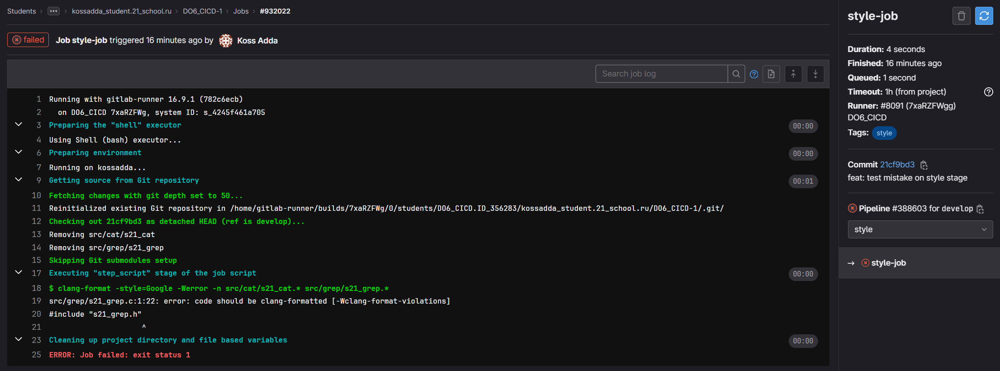

# Basic CI/CD

Разработка простого **CI/CD** для проекта *SimpleBashUtils*. Сборка, тестирование, развертывание.

<br>

## Содержание

1. [Настройка gitlab-runner](#part-1-настройка-gitlab-runner) \
  1.1. [Установка виртуальной машины](#поднять-виртуальную-машину-ubuntu-server-2204-lts) \
  1.2. [Установка gitlab-runner](#скачать-и-установить-на-виртуальную-машину-gitlab-runner) \
  1.3. [Регистрация в gitlab-runner](#запустить-gitlab-runner-и-зарегистрировать-его-для-использования-в-текущем-проекте-do6_cicd)
2. [Cборка](#part-2-сборка) \
  2.1. [Добавление этапа сборки](#напиcать-этап-для-ci-по-сборке-приложений-из-проекта-c2_simplebashutils) \
  2.2. [Неподготовленная оболочка](#неподготовленная-оболочка) \
  2.3. [Проверка сборки проекта](#проверка-сборки-проекта)
3. [Тест кодстайла](#part-3-тест-кодстайла) \
  3.1. [Добавление этапа теста кодстайла](#напиcать-этап-для-ci-который-запускает-скрипт-кодстайла-clang-format) \
  3.2. [Ошибочный вывод пайплайна](#проверить-зафейлился-ли-пайплайн-если-совершена-ошибка-в-кодстайле) \
  3.3. [Корректный вывод пайплайна](#исправить-ошибку-в-форматировании-кода-и-проверить-результат)

<br>


## [Part 1. Настройка **gitlab-runner**](#содержание)

**== Задание ==**

### Поднять виртуальную машину *Ubuntu Server 22.04 LTS*

 

> В дальнейшем работа на Ubutu Server будет производиться через openssh на декстопной версии Ubuntu

### Скачать и установить на виртуальную машину **gitlab-runner**

> Был выбран метод установки gitlab-runner через [бинарный файл с официального сайта](https://docs.gitlab.com/runner/install/linux-manually.html)

1. Загрузить бинарный файл <br>
```sh
sudo curl -L --output /usr/local/bin/gitlab-runner "https://s3.dualstack.us-east-1.amazonaws.com/gitlab-runner-downloads/latest/binaries/gitlab-runner-linux-amd64"
```
2. Дать файлу разрешение на исполнение: <br>
```sh
sudo chmod +x /usr/local/bin/gitlab-runner
```
3. Создать пользователя GitLab CI <br>
```sh
sudo useradd --comment 'GitLab Runner' --create-home gitlab-runner --shell /bin/bash
```
4. Установить как службу <br>
```sh
sudo gitlab-runner install --user=gitlab-runner --working-directory=/home/gitlab-runner
```
5. Запустить службу
```sh
sudo gitlab-runner start
```

 

### Запустить **gitlab-runner** и зарегистрировать его для использования в текущем проекте (*DO6_CICD*)

> Для регистрации понадобятся URL и токен, которые можно получить на страничке задания на платформе

 

- Зарегистрировать gitlab-runner
```ssh
sudo gitlab-runner register
```
> Для этого необходимо ввести данные при регистрации: <br>
> 1. Cвой URL-адрес GitLab
> 2. Cвой регистрационный токен
> 3. Описание для у
> 4. Теги для заданий, разделенные запятыми
> 5. Тип исполнителя

 


## [Part 2. Сборка](#содержание)

### Напиcать этап для CI по сборке приложений из проекта *C2_SimpleBashUtils*

- В корне репозитория создать файл `.gitlab-ci.yml`

```ssh
touch .gitlab-ci.yml
```

- Добавить в файл этап запуска сборки через мейк файл из проекта C2.

> Настроим также этап, чтобы файлы, полученные после сборки (артефакты), сохранялись со сроком хранения 30 дней.


### Неподготовленная оболочка

- При пуше мы столкнемся со следующей ошибкой


> Раннер нас предупреждает, что среда не подготовлена к запуску. Причиной послужила дефолтная конфигурация gitlab-runner, производящая очистку терминала при выходе из оболочки shell. Комментирование строк данного скрипта устраняет данную ошибку

- Закомментируем строки в `/home/gitlab-runner/.bash_logout`


### Проверка сборки проекта

- Перезапустим пайплайн и проверим пропала ли ошибка


- Как можно увидеть, сборка была успешно осуществлена, исполняемые файлы были сохранены на 30 дней


## [Part 3. Тест кодстайла](#содержание)

### Напиcать этап для CI, который запускает скрипт кодстайла (clang-format)


### Проверить зафейлился ли пайплайн, если совершена ошибка в кодстайле

- Проверим сначала вывод команды локально


- Как и ожидалось - пайплайн зафейлился


- Вывод пайплайна совпал с локальным выводом команды



### Исправить ошибку в форматировании кода и проверить результат

- Результат работы пайплайна


- Теперь проект успешно проходит тест кодстайла


